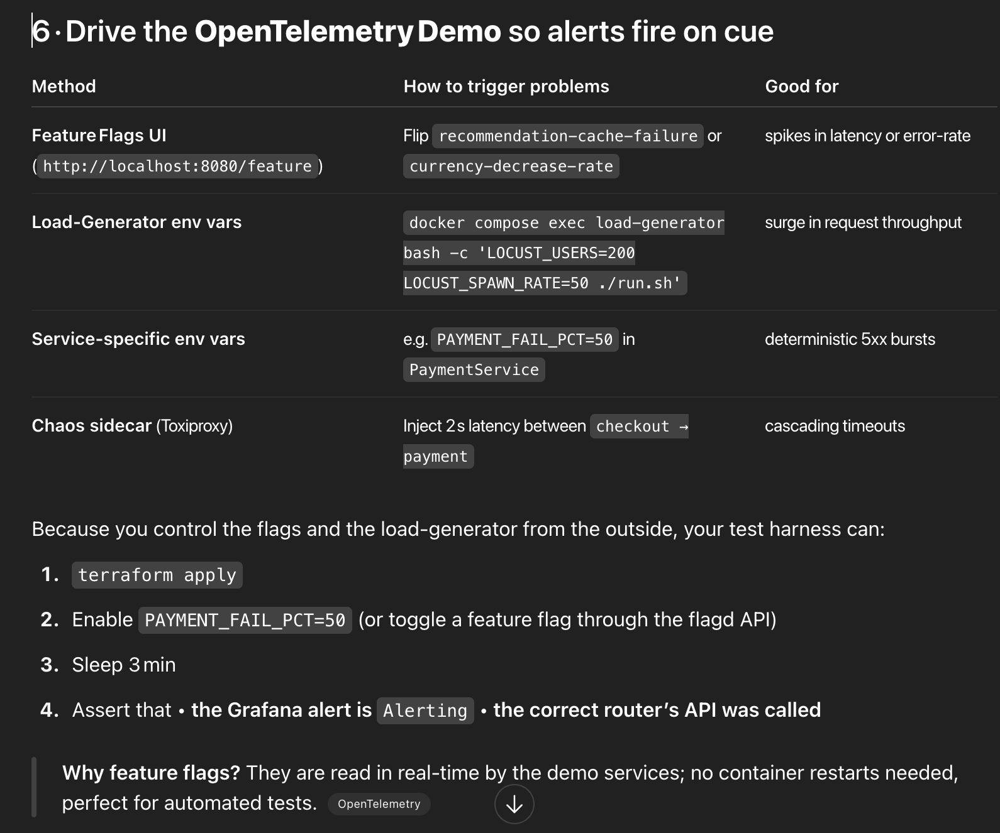
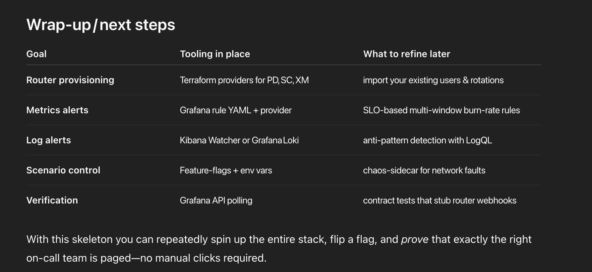

# Incident router provisioning

## 1 · Spin up the telemetry sandbox
```bash
git clone https://github.com/open-telemetry/opentelemetry-demo
cd opentelemetry-demo
# run only the containers you need + extra exporters
docker compose \
  -f docker-compose.yml \
  -f docker-compose.grafana.yaml \
  -f docker-compose.prometheus.yaml \
  up -d

```

## 2 · Provision PagerDuty, Squadcast and xMatters with Terraform

### Providers

```hcl
terraform {
  required_providers {
    pagerduty = { source = "pagerduty/pagerduty" }
    squadcast = { source = "SquadcastHub/squadcast" }
    xmatters  = { source = "xmatters/xmatters" }
    grafana   = { source = "grafana/grafana" }
  }
}

provider "pagerduty" {
  token = var.pd_token
}

provider "squadcast" {
  api_key = var.squadcast_token        # :contentReference[oaicite:1]{index=1}
}

provider "xmatters" {
  api_key = var.xm_api_key             # :contentReference[oaicite:2]{index=2}
}

provider "grafana" {
  url  = "http://localhost:3000"
  auth = "admin:admin"                 # change in real runs!
}

```

### Example PagerDuty

```hcl
resource "pagerduty_team" "payments" {
  name = "payments"
}

resource "pagerduty_escalation_policy" "payments" {
  name         = "Payments escalation"
  num_loops    = 2
  escalation_rules {
    escalation_delay_in_minutes = 10
    targets { type = "user", id = var.payments_primary_id }
  }
  teams = [pagerduty_team.payments.id]
}

resource "pagerduty_service" "checkout" {
  name                    = "checkout"
  escalation_policy       = pagerduty_escalation_policy.payments.id
  auto_resolve_timeout    = 14400
  acknowledgement_timeout = 600
}

output "pd_checkout_key" {
  value = pagerduty_service.checkout.integration_key
}

```

## 3 · Register those keys as Grafana Contact Points (also Terraform)

```hcl
resource "grafana_contact_point" "pd_payments" {
  name = "PD‑Payments"
  pagerduty {
    routing_key = pagerduty_service.checkout.integration_key
  }
}

resource "grafana_contact_point" "sc_orders" {
  name = "SC‑Orders"
  squadcast {
    url = squadcast_service.orders.webhook_url
  }
}

resource "grafana_contact_point" "xm_inventory" {
  name = "XM‑Inventory"
  xmatters {
    url = xmatters_inbound_integration.inventory.url
  }
}

```

4 · Attach routing rules (Notification Policies)
Each alert rule in Grafana should carry a team label. A single notification policy then fans out to the right router:

```hcl
resource "grafana_notification_policy" "root" {
  group_by = ["alertname","team"]
  routes {
    object_matchers = { team = "payments" }
    contact_point   = grafana_contact_point.pd_payments.name
  }
  routes {
    object_matchers = { team = "orders" }
    contact_point   = grafana_contact_point.sc_orders.name
  }
  routes {
    object_matchers = { team = "inventory" }
    contact_point   = grafana_contact_point.xm_inventory.name
  }
}

```

5 · Author alert rules for metrics and logs
Metrics (Prometheus → Grafana)

```yaml
# grafana/provisioning/alerting/rules/high_error.yaml
groups:
  - name: service-errors
    interval: 30s              # evaluation frequency
    rules:
      - uid:  high_error_rate
        title: "5xx > 5 % - {{ $labels.service }}"
        condition: "C"
        data:
          - refId: "A"         # Prometheus query
            expr: |
              sum by (service)(rate(http_server_errors_total{service!="loadgenerator"}[2m]))
              /
              sum by (service)(rate(http_server_requests_total{service!="loadgenerator"}[2m]))
        no_data_state: OK
        exec_err_state: Alerting
        for: 2m
        labels:
          severity: page
          team: payments

```

***Provision it with the Grafana provider’s grafana_folder + grafana_rule_group, or mount as YAML.***
- Logs (Kibana / Elasticsearch Watcher)
  - If you ingest the demo’s container logs with Filebeat:

```json
PUT _watcher/watch/checkout_failed_payments
{
  "trigger": { "schedule": { "interval": "30s" } },
  "input": {
    "search": {
      "request": {
        "indices": ["filebeat-*"],
        "body": {
          "query": {
            "match_phrase": { "message": "Payment declined" }
          }
        }
      }
    }
  },
  "condition": {
    "compare": { "ctx.payload.hits.total.value": { "gt": 3 } }
  },
  "actions": {
    "webhook_pd": {
      "webhook": {
        "method": "POST",
        "url": "${PD_CHECKOUT_URL}",      // rendered by Terraform
        "body": "{\"summary\":\"Payment errors spiking\"}"
      }
    }
  }
}
```



## 7 · End‑to‑end smoke test (bash example)

```bash
# ensure a clean slate
docker compose restart paymentservice
curl -X POST http://localhost:8080/flag -H 'Content-Type: application/json' \
     -d '{"payment-failure-rate":0.5}'

# wait until Prometheus scrapes the new metrics twice
sleep 150

# poll Grafana Alerting API
ALERT_STATE=$(curl -s -u admin:admin \
  "http://localhost:3000/api/alerting/alert-instances?alertUid=high_error_rate" \
  | jq -r .instances[].currentState)

if [[ "$ALERT_STATE" == "alerting" ]]; then
  echo "✅ alert fired"
else
  echo "❌ alert did not fire"; exit 1
fi

```
A CI stage can then hit PagerDuty, Squadcast and xMatters REST APIs to verify that incidents arrived and were acknowledged.

